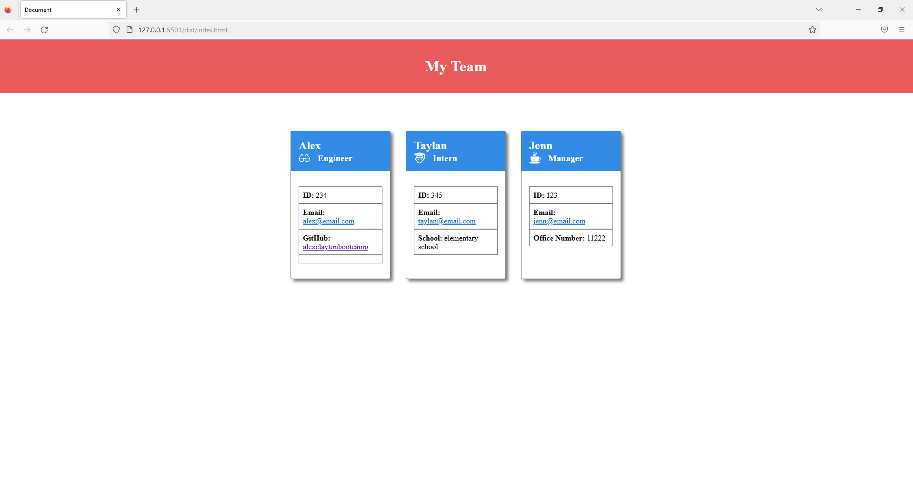

# Alex Clayton's Team Profile Generator

## Introduction
This project was developed by Alex Clayton as part of the KU Coding Bootcampt 10-OOP Challenge.  This is a team profile generator that takes user input to generate an HTML page showing different team member cards.

## What's in the project?
The acceptance criteria for this project are as follows:

1.  WHEN I click on an email address in the HTML
    THEN my default email program opens and populates the TO field of the email with the address

    Achieved using a link in the HTML file with the mailto: designation

2.  WHEN I click on the GitHub username
    THEN that GitHub profile opens in a new tab

    Achieved using a link in the HTML file

3.  WHEN I start the application
    THEN I am prompted to enter the team manager’s name, employee ID, email address, and office number

    Application starts with the command "node index.js".  Prompts the user to answer questions specific to the manager class.

4.  WHEN I enter the team manager’s name, employee ID, email address, and office number
    THEN I am presented with a menu with the option to add an engineer or an intern or to finish building my team

    Once finished with the manager information, the user is prompted with the menu options.  This menu prompt occurs after each new team member is added to the application.

5.  WHEN I select the engineer option
    THEN I am prompted to enter the engineer’s name, ID, email, and GitHub username, and I am taken back to the menu

    Engineer inquirer question prompts are unique to the engineer class and the user is presented with the add new team member or finish menu upon completion

6.  WHEN I select the intern option
    THEN I am prompted to enter the intern’s name, ID, email, and school, and I am taken back to the menu 

    Intern inquirer question prompts are unique to the intern class and the user is taken back to the menu upon completion
    
7.  WHEN I decide to finish building my team
    THEN I exit the application, and the HTML is generated

    Upon completion of the team member inputs, an HTML file and CSS stylesheet are generated in the dist folder.


## The completed project resembles the following image when deployed:

Full Size Image of the Webpage




## Usage

To start the application run the following command:

```
node index.js
```

## Resources

[Walkthrough tutorial recorded using screencastify](https://drive.google.com/file/d/1-Y4KDD35YgwI1aHmqP9I14XA95Aymg0G/view)

